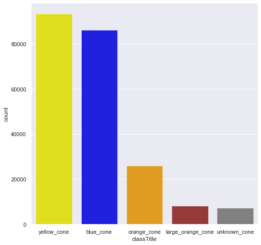
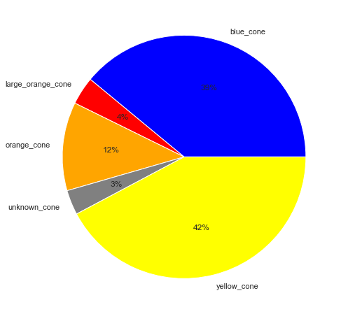
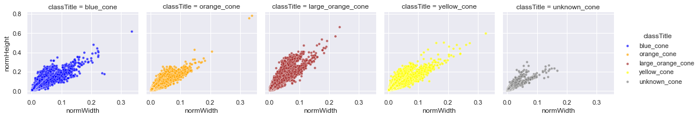
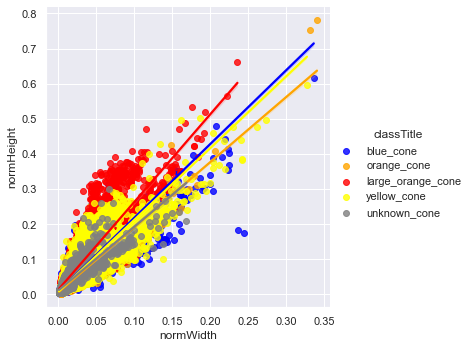
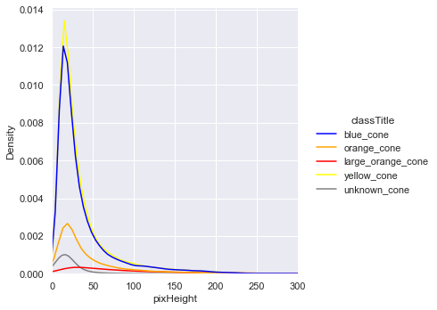
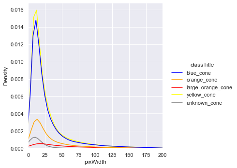

# FSOCO_STATS
My interpretation of FSOCO dataset. Analysis was made as a task in the science club : AGH_RACING

## FSOCO DATASET ANALYSIS
⚫ The image below shows placement of all the cones from the dataset. It seems that most of them are in the centre and in the second plan/horizon of the image.

⚪ The images shows how many cones of a specific type is located in the dataset. You can see that there noticeably more yellow and blue cones compared to the other cones. It is worth paying attention to the fact that only 3% of the dataset consist of photos which include unknown cones.
  
 
  
 
⚫ The images shows relationship between weight and height of the cones. It seems that most of the cones are in the same size, except large orange cones which are naturally larger than casual cones. You can see small deviations in the data, which can affect the training of machine learning models. The result may be lower precision of the model.
  

  
⚪ The deviations in the data are better noticeable, when we compare all the cones in the one place. In my opinion, augmentation of the data should be mandatory to achieve better precision of the machine learning models.

 
 
⚫ The images below shows clear correlation between height/ width and density of pixels in the pictures. It seems that peak of density for all the cones is about 20 x 20 pixels.  
  
  
  

### Dataset is available under the following link:
- https://www.fsoco-dataset.com/download
