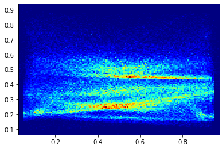

# FSOCO_stats
My interpretation of FSOCO dataset

## Results
The image below shows placement of all the cones from the dataset. It seems that most of them are in the centre and in the second plan/horizon of the image

### Dataset is available under the following link:
- https://www.fsoco-dataset.com/download
